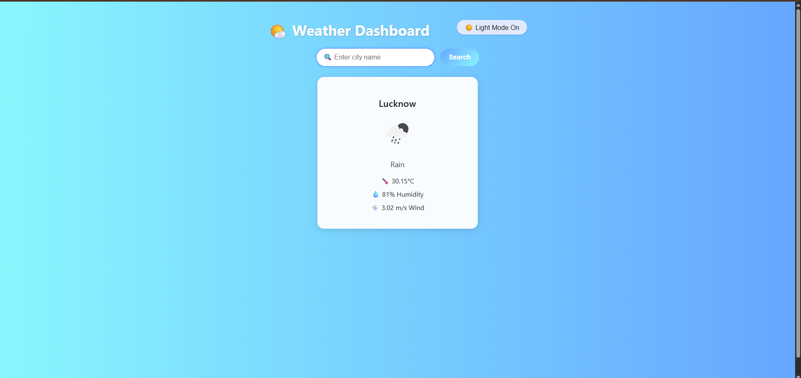

# Weather Dashboard

A full-stack weather application that lets users search and view real-time weather information for any city worldwide.
Built with React (frontend) and Express.js (backend), powered by the OpenWeather API.

✨ Features

🔍 Search by city name

🌡️ Current weather details: temperature, humidity, wind speed, and conditions

📱 Responsive design for desktop & mobile

🎨 Modern UI/UX with clean cards and animations

⚡ Full-stack architecture (React + Express)

📂 Project Structure
weather_project/
├── client/              # React frontend
│   ├── src/
│   │   ├── components/  # SearchBar, WeatherCard, etc.
│   │   ├── App.js       # Main React app
│   │   └── index.js     # Entry point
│   └── public/
│       └── index.html   # HTML template
│
├── server/              # Express backend
│   ├── routes/          # API routes
│   ├── server.js        # Server entry
│   └── .env             # API key config
│
├── screenshots/         # App screenshots
└── README.md            # Documentation

🚀 Getting Started
✅ Prerequisites

Node.js (v16+ recommended)

npm or yarn

⚙️ Setup

Clone the repository

git clone https://github.com/SIDDHARRTHA/Weather_Showing.git
cd Weather_Showing

Install dependencies

# Client
cd client
npm install

# Server
cd ../server
npm install

Configure API key
Add your OpenWeather API key to server/.env:

OPENWEATHER_API_KEY=your_api_key_here

▶️ Running the App

Start the backend (Express server):

cd server
node server.js

Start the frontend (React app):

cd client
npm start

Open http://localhost:3000 in your browser 🎉

📸 Screenshots

Search Page:

Weather Details Page:

Add your screenshots as `search.png` and `details.png` in the `screenshots/` folder.

🛠️ Tech Stack

Frontend: React, CSS

Backend: Express.js, Node.js

API: OpenWeather

Styling: Modern CSS (responsive + animations)

🤝 Contributing

Contributions are welcome! Feel free to fork this repo, create a feature branch, and submit a PR.

📜 License

This project is licensed under the MIT License.
04 Weather Dashboard

A full-stack weather application that lets users search and view real-time weather information for any city worldwide.
Built with React (frontend) and Express.js (backend), powered by the OpenWeather API.

31 Features

50d Search by city name

3213fb Current weather details: temperature, humidity, wind speed, and conditions

4f1 Responsive design for desktop & mobile

3a8 Modern UI/UX with clean cards and animations

4a1 Full-stack architecture (React + Express)

4c2 Project Structure
weather_project/
├── client/              # React frontend
│   ├── src/
│   │   ├── components/  # SearchBar, WeatherCard, etc.
│   │   ├── App.js       # Main React app
│   │   └── index.js     # Entry point
│   └── public/
│       └── index.html   # HTML template
│
├── server/              # Express backend
│   ├── routes/          # API routes
│   ├── server.js        # Server entry
│   └── .env             # API key config
│
└── README.md            # Documentation

680 Getting Started
197 Prerequisites

Node.js (v16+ recommended)

527 Setup

Clone the repository

git clone https://github.com/SIDDHARRTHA/Weather_Showing.git
cd Weather_Showing

Install dependencies

# Client
cd client
npm install

# Server
cd ../server
npm install

Configure API key
Add your OpenWeather API key to server/.env:

OPENWEATHER_API_KEY=your_api_key_here

449 Running the App

Start the backend (Express server):

cd server
node server.js

Start the frontend (React app):

cd client
npm start

Open http://localhost:3000 in your browser 389

4f8 Screenshots
Search Weather	Weather Details

	
6e0 Tech Stack

Frontend: React, CSS

Backend: Express.js, Node.js

API: OpenWeather

Styling: Modern CSS (responsive + animations)

91d Contributing

Contributions are welcome! Feel free to fork this repo, create a feature branch, and submit a PR.

4dc License

This project is licensed under the MIT License.
